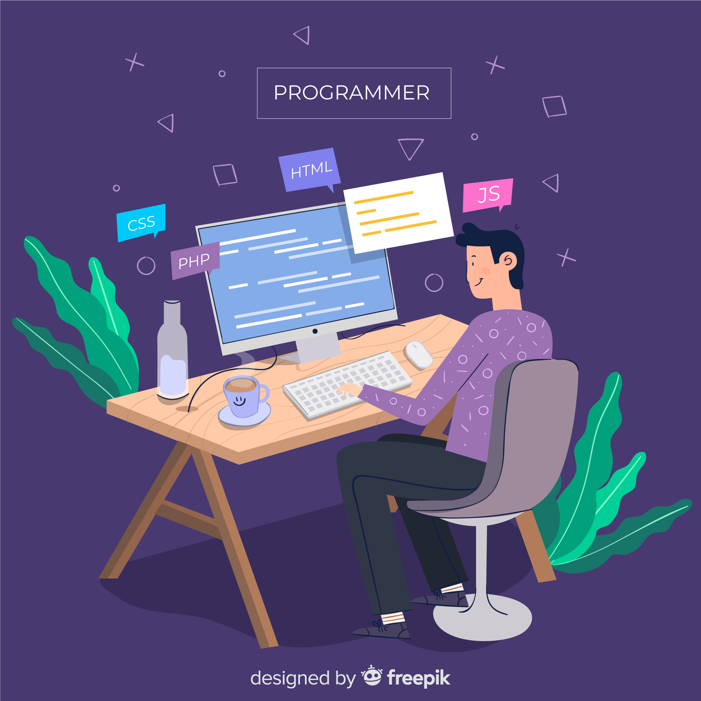

  

---

# 💫About Me :

  

 

💻 &nbsp;Working as a Software Development Engineer - 1 at Truminds Software Systems.

👯 I’m looking to collaborate on **Open Source Projects using JavaScript, Typescript**.   

🍎  **Beginner Mindset** (Open to Learning).

⚡ I am a  **Gearhead and Travel Addict.**

😄 Pronouns: **He/Him.**

⚡ Fun fact: **I play drums.**

  

## 🌐Socials
 
 
 
 

  

# 💻Tech Stack  
 

      
 
 
 
 
 
 

 
 
 

# 📊GitHub Stats :
 
 

## 🏆GitHub Trophies

### ✍️Random Dev Quote

---
